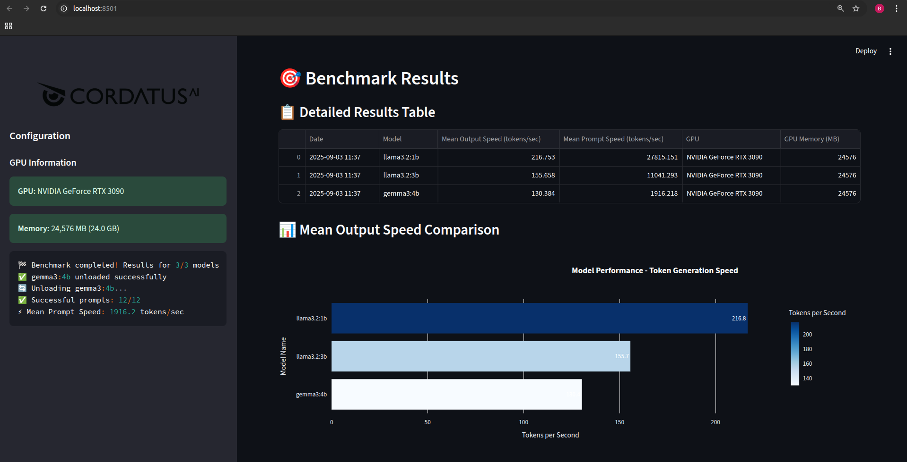
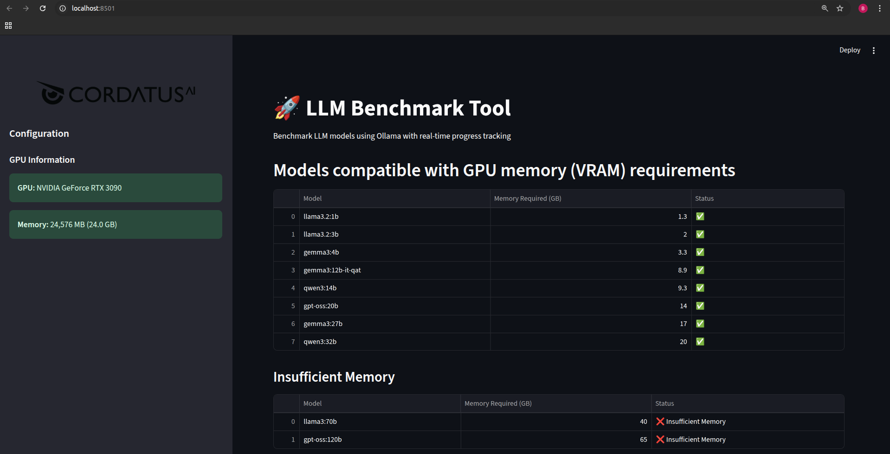
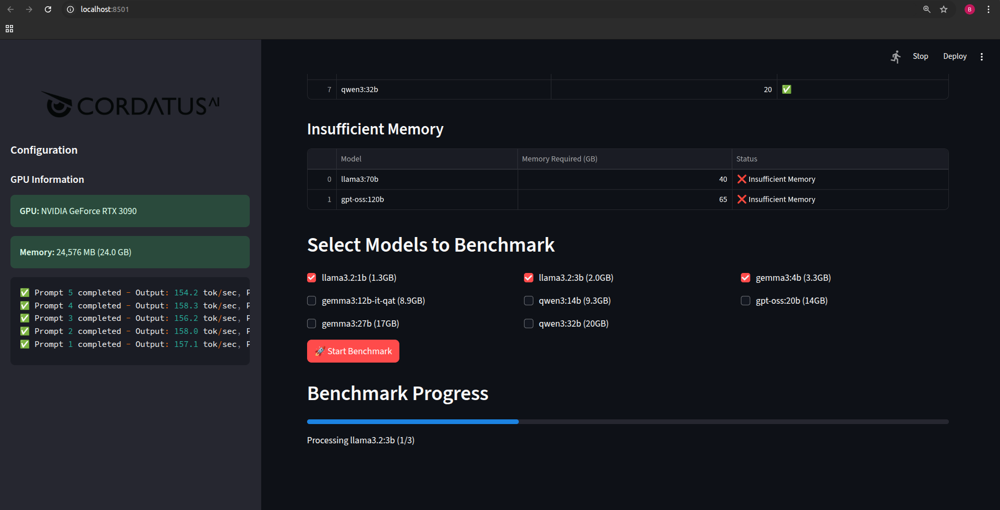

# 🚀 LLM Benchmark Tool

A lightweight, real‑time Streamlit application for benchmarking large language models (LLMs) that are hosted with **Ollama**.
The tool automatically detects your GPU, filters models by VRAM requirements, pulls missing models, runs a prompt‑based benchmark, and visualises the results with interactive Plotly charts.Overview



The **LLM Benchmark Tool** is a Streamlit web app that:

- Detects your GPU (NVIDIA or Jetson) and its VRAM.
- Reads a `models.json` file that lists available Ollama models and their VRAM requirements.
- Shows which models can run on your GPU.
- Lets you select one or more models to benchmark.
- Pulls missing models automatically.
- Sends a set of prompts to each model, measuring:
  - **Output speed** – tokens generated per second.
  - **Prompt speed** – tokens processed per second.
- Unloads each model after benchmarking to free VRAM.
- Stores results in `benchmark_results.csv` and offers a download button.
- Visualises results with Plotly bar charts, a scatter plot, and summary metrics.

> **Why Ollama?**
> Ollama provides a lightweight, local inference engine that can pull large models from the community hub. This tool leverages Ollama’s streaming API to get real‑time progress and performance metrics.models.json

### `models.json` format

```json
{
  "llama3.2:1b": 1.3,
  "llama3.2:3b": 2.0,
  "gemma3:4b": 3.3,
}
```

### `test_prompts.txt`

One prompt per line. Example:

```
What is AI?
Define quantum computing.
How does blockchain work?
```

------

## Installation

```bash
# 1. Clone the repo
git clone https://github.com/CordatusAI/ollama-benchmark.git
cd ollama-benchmark

# 2. Create a virtual environment (optional but recommended)
python -m venv venv
source venv/bin/activate   # Windows: venv\Scripts\activate

# 3. Install Python dependencies
pip install -r requirements.txt

# 4. Install Ollama (if not already)
#   - macOS/Linux: brew install ollama
#   - Windows: download installer from https://ollama.ai
```

> **Tip** – The app will automatically pull any missing models when you start a benchmark.

## Usage

```
streamlit run llm_benchmark_tool.py
```

1. **Open the app** – A browser window opens at `http://localhost:8501`.
2. **Select models** – Tick the checkboxes for the models you want to benchmark.
3. **Start** – Click **🚀 Start Benchmark**.
4. **Watch** – The sidebar shows logs and progress bars.
5. **View results** – After completion, the main panel shows a table and charts.
6. **Export** – Click the download button or open `benchmark_results.csv`.

## Results

The app writes a CSV file named `benchmark_results.csv` that contains:

| Date | Model | Mean Output Speed (tokens/sec) | Mean Prompt Speed (tokens/sec) | GPU  | GPU Memory (MB) |
| ---- | ----- | ------------------------------ | ------------------------------ | ---- | --------------- |
|      |       |                                |                                |      |                 |

You can open this file in Excel, Google Sheets, or any CSV viewer. The download button in the app provides the same file.

------

## Screenshots





